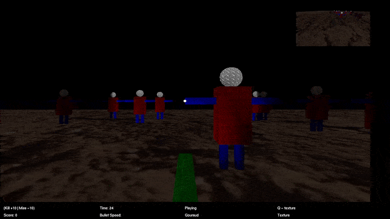
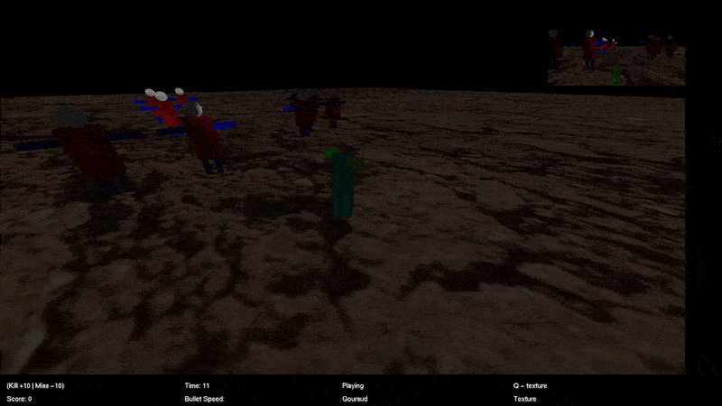

# OpenGL Computer Graphics Game
Robot-shooting game made for a computer graphics class to demonstrate real-time lighting, texturing, and explore graphic pipeline implementation

## Overview
This project is a custom OpenGL rendering engine written in modern C++ (GLFW + GLEW).  
It was built to demonstrate a clear understanding of:

- The graphics rendering pipeline  
- Lighting models  
- Texture mapping and sampling  
- Coordinate transformations and matrices  
- Rendering architecture and engine structure  

---

## Demo 
- **GIFs / Screenshots:**  
  -   
  - 
  - 

---

## Skills Demonstrated
- C++ design 
- GPU pipeline understanding  
- Texture mapping
- Object loading
- Coordinate transformations, view volumes, clipping  
- Debugging rendering bugs (coordinate systems, depth issues, texture alignment)
- Practical experience with OpenGL API

---

## How to Run

### **Prerequisites**
- C++17 or later  
- GLFW  
- GLEW  
- Visual Studio

### **Setup**
- Open the visual studio sln
- Build solution

## Controls 

- w: Wireframe mode
- s: solid mode
- q: texture mode
- a: display axis
- c: display colliders
- m: move mode
- o: Toggle OBJ rendering
- l: Toggle Point/Directional light
- ESC: Pause Program
- F1: Toggle full screen
- F2: Swap FPV with ESV
- F3: Toggle Game Sound
- F4: Toggle Flat/Gouraud shading
- Up: Move Camera forward
- Down: Move the camera backwards
- Left: Rotate the camera left
- Right: Rotate the camera right
- Left click: (ESV Mode) Control Arcball angles
- Scroll Wheel: (ESV Mode) Control Arcball radius/zoom

## Game Rules
- Kill = +10 Score
- Miss = -10 Score

## Technologies Used

- C++17

- Legacy OpenGL (immediate mode)

- GLFW

- GLEW

- irrklang

- assimp

- stb_image

## Contact
**Isaac Hraga**
- GitHub: https://github.com/isaachraga
- LinkedIn: www.linkedin.com/in/isaac-hraga-5b7535b2
